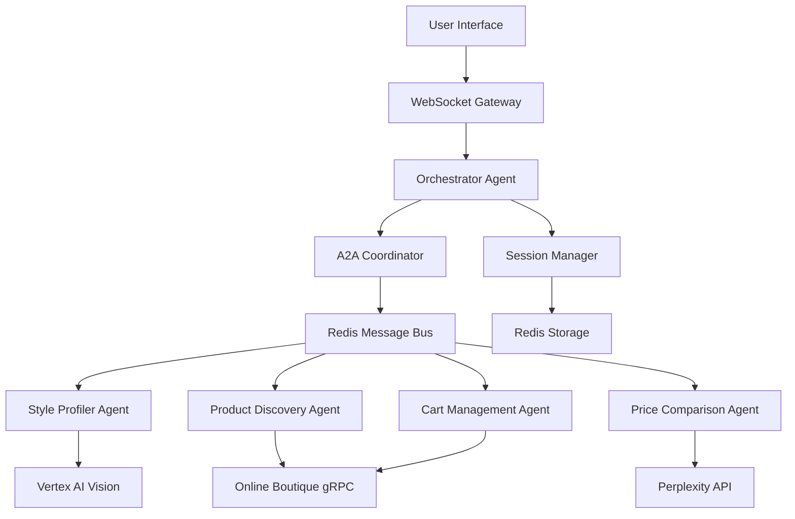
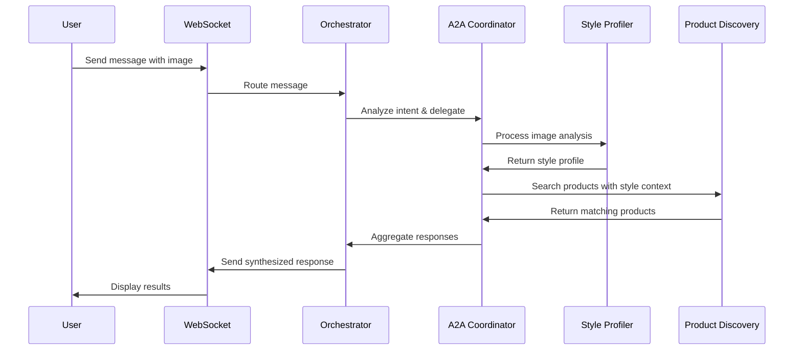

# CartMate Backend Design Document

## Overview

The CartMate backend implements a multi-agent conversational shopping assistant using Google's A2A (Agent-to-Agent) protocol. The system follows a microservices-inspired agent architecture where specialized agents handle different shopping domains, coordinated through a central orchestrator.

The design emphasizes incremental development, starting with a core orchestrator agent and WebSocket infrastructure, then progressively adding specialized agents for style analysis, product discovery, price comparison, and cart management.

## Architecture

### High-Level Architecture



### Agent Communication Flow



## Components and Interfaces

### 1. Core Infrastructure Layer

#### WebSocket Gateway (`api/websocket.py`)
- **Purpose**: Real-time bidirectional communication with frontend
- **Key Methods**:
  - `connect(websocket, session_id)`: Establish connection and session
  - `disconnect(websocket)`: Clean up connection and resources
  - `send_message(session_id, message)`: Send message to specific session
  - `broadcast_typing(session_id)`: Send typing indicators

#### Session Manager (`services/storage/session_manager.py`)
- **Purpose**: Manage user sessions and context persistence
- **Key Methods**:
  - `create_session(user_id)`: Initialize new session with unique ID
  - `get_session(session_id)`: Retrieve session data and context
  - `update_context(session_id, context)`: Update conversation context
  - `cleanup_expired_sessions()`: Remove expired session data

#### Redis Client (`services/storage/redis_client.py`)
- **Purpose**: Centralized Redis operations for caching and pub/sub
- **Key Methods**:
  - `get/set/delete(key, value)`: Basic key-value operations
  - `publish/subscribe(channel, message)`: Pub/sub for agent communication
  - `store_user_profile(user_id, profile)`: Persist user data
  - `get_cart_state(session_id)`: Retrieve cart information

### 2. A2A Protocol Layer

#### A2A Coordinator (`a2a/coordinator.py`)
- **Purpose**: Central hub for agent discovery and message routing
- **Key Methods**:
  - `register_agent(agent_info)`: Register agent capabilities
  - `discover_agents(capability_filter)`: Find agents by capability
  - `route_message(from_agent, to_agent, message)`: Route inter-agent messages
  - `broadcast_message(message, agent_filter)`: Send to multiple agents

#### A2A Protocol (`a2a/protocol.py`)
- **Purpose**: Standardized message format and validation
- **Message Structure**:
```python
class A2AMessage:
    id: str
    from_agent: str
    to_agent: str
    message_type: str
    payload: dict
    context: dict
    timestamp: datetime
```

#### Message Bus (`a2a/message_bus.py`)
- **Purpose**: Redis-based pub/sub for agent communication
- **Key Methods**:
  - `publish_to_agent(agent_id, message)`: Send message to specific agent
  - `subscribe_to_messages(agent_id, callback)`: Listen for messages
  - `create_agent_channel(agent_id)`: Set up agent communication channel

### 3. Agent Layer

#### Base Agent (`agents/base_agent.py`)
- **Purpose**: Common functionality for all agents
- **Key Methods**:
  - `register()`: Register with A2A coordinator
  - `handle_message(message)`: Process incoming A2A messages
  - `send_response(to_agent, response)`: Send response via A2A
  - `log_interaction(interaction)`: Log agent activities

#### Orchestrator Agent (`agents/orchestrator_agent.py`)
- **Purpose**: Primary conversational AI and intelligent coordinator
- **Core Function**: Acts as the user's main shopping companion, engaging in natural conversation while intelligently coordinating specialized agents when needed
- **Conversational Nature**: The orchestrator is not just a routing switch - it actively participates in conversations, provides shopping advice, asks clarifying questions, and maintains context across the entire shopping journey
- **Capabilities**:
  - **Natural Conversation**: Engages users in fluid shopping conversations using Vertex AI Gemini
  - **Intelligent Reasoning**: Analyzes user needs and decides when and how to involve specialized agents
  - **Contextual Responses**: Provides personalized shopping advice based on conversation history and user preferences
  - **Streaming Communication**: Shares its thinking process and agent consultations transparently
  - **Shopping Expertise**: Offers fashion advice, styling tips, and shopping guidance independently
  - **Agent Orchestration**: Delegates complex tasks to specialized agents when their expertise is needed
  - **Response Synthesis**: Combines agent outputs with its own insights to create comprehensive responses
  - **Conversational Streaming**: Provides incremental responses during processing, showing its reasoning and delegation decisions to users in real-time. Rather than waiting silently for all agents to respond, it streams partial responses explaining what it's doing ("Let me analyze your photo...", "Now searching for products...") and which agents it's consulting, creating a transparent and engaging conversational experience similar to modern LLM interfaces.
- **Key Methods**:
  - `process_user_message(message, session_id)`: Main entry point
  - `analyze_intent(message)`: Determine user intent using AI
  - `delegate_to_agents(intent, context)`: Route to appropriate agents
  - `synthesize_response(agent_responses)`: Create coherent user response
  - `send_partial_response(session_id, message)`: Send incremental responses during processing
  - `show_agent_delegation(session_id, agent_name, task)`: Inform user about agent consultation
  - `stream_thinking_process(session_id, reasoning)`: Show AI reasoning in real-time

**Key Design Principle**: The orchestrator is a conversational AI shopping assistant first, and an agent coordinator second. It can handle many shopping conversations independently, only delegating to specialized agents when their specific expertise (style analysis, external price search, etc.) is required. This creates a natural conversation flow where users feel they're talking to one intelligent assistant, not a routing system.

#### Style Profiler Agent (`agents/style_profiler_agent.py`)
- **Purpose**: Image analysis and style preference learning
- **Capabilities**:
  - Image analysis using Vertex AI Vision
  - Style element extraction (colors, patterns, cuts)
  - User preference learning and profile building
  - Brand recognition and aesthetic categorization
- **Key Methods**:
  - `analyze_image(image_data)`: Process uploaded images
  - `extract_style_elements(analysis_result)`: Parse AI analysis
  - `update_user_profile(user_id, style_data)`: Update preferences
  - `get_style_recommendations(user_id)`: Generate style suggestions

#### Product Discovery Agent (`agents/product_discovery_agent.py`)
- **Purpose**: Product search and recommendation
- **Capabilities**:
  - Integration with Online Boutique Product Catalog
  - Style-aware product filtering and ranking
  - Semantic search with style context
  - Inventory availability checking
- **Key Methods**:
  - `search_products(query, style_context)`: Main search function
  - `filter_by_style(products, style_profile)`: Apply style filtering
  - `rank_by_relevance(products, context)`: Sort by relevance
  - `check_availability(product_ids)`: Verify stock status

#### Price Comparison Agent (`agents/price_comparison_agent.py`)
- **Purpose**: External price research and competitive analysis
- **Capabilities**:
  - Multi-retailer price comparison via Perplexity API
  - Deal finding and price alert management
  - Value assessment based on style preferences
- **Key Methods**:
  - `compare_prices(product_info)`: Search external retailers
  - `analyze_deals(price_data)`: Identify best values
  - `set_price_alert(user_id, product_id, target_price)`: Monitor prices
  - `get_price_history(product_id)`: Historical pricing data

#### Cart Management Agent (`agents/cart_management_agent.py`)
- **Purpose**: Shopping cart operations and optimization
- **Capabilities**:
  - Integration with Online Boutique Cart Service
  - Style coherence validation
  - Bundle optimization for complete looks
  - Cart persistence across sessions
- **Key Methods**:
  - `add_to_cart(session_id, product_id, quantity)`: Add items
  - `validate_style_coherence(cart_items)`: Check style compatibility
  - `suggest_complementary_items(cart_items)`: Recommend additions
  - `optimize_cart_bundles(cart_items)`: Create outfit bundles

### 4. External Service Integration Layer

#### Vertex AI Client (`services/external/vertex_ai_client.py`)
- **Purpose**: Google Cloud AI integration for text and vision
- **Key Methods**:
  - `analyze_text(text, task_type)`: Process natural language
  - `analyze_image(image_data, analysis_type)`: Vision analysis
  - `generate_response(prompt, context)`: Generate conversational responses

#### Online Boutique Clients (`services/boutique/`)
- **Product Client**: gRPC integration with Product Catalog Service
- **Cart Client**: Shopping cart operations
- **Currency Client**: Price formatting and conversion
- **Payment Client**: Checkout and payment processing

#### Perplexity Client (`services/external/perplexity_client.py`)
- **Purpose**: External web search for price comparison
- **Key Methods**:
  - `search_product_prices(product_name, brand)`: Price search
  - `get_retailer_info(product_url)`: Extract retailer data

## Data Models

### User Profile Model (`models/user.py`)
```python
class UserProfile:
    user_id: str
    style_profile: StyleProfile
    preferences: dict
    purchase_history: List[dict]
    created_at: datetime
    updated_at: datetime
```

### Style Profile Model (`models/style_profile.py`)
```python
class StyleProfile:
    user_id: str
    color_palette: List[str]
    preferred_styles: List[str]
    body_type: str
    size_preferences: dict
    brand_preferences: List[str]
    occasion_preferences: List[str]
    style_evolution: List[dict]
```

### Product Model (`models/product.py`)
```python
class Product:
    id: str
    name: str
    description: str
    price: float
    currency: str
    category: str
    style_tags: List[str]
    colors: List[str]
    sizes: List[str]
    brand: str
    image_urls: List[str]
    availability: bool
```

### A2A Message Model (`models/a2a_messages.py`)
```python
class A2AMessage:
    id: str
    from_agent: str
    to_agent: str
    message_type: MessageType
    payload: dict
    context: ConversationContext
    timestamp: datetime
    priority: int
```

## Error Handling

### Error Categories
1. **User Input Errors**: Invalid requests, malformed data
2. **External Service Errors**: API failures, timeouts, rate limits
3. **Agent Communication Errors**: A2A protocol failures, agent unavailability
4. **Data Persistence Errors**: Redis failures, session corruption
5. **AI Service Errors**: Vertex AI failures, analysis errors

### Error Handling Strategy
- **Graceful Degradation**: Continue operation with reduced functionality
- **Retry Logic**: Exponential backoff for transient failures
- **Fallback Responses**: Default responses when AI services fail
- **User Communication**: Clear, actionable error messages
- **Logging**: Comprehensive error logging for debugging

### Error Response Format
```python
class ErrorResponse:
    error_code: str
    message: str
    details: dict
    suggested_actions: List[str]
    timestamp: datetime
```

## Testing Strategy

### Unit Testing
- **Agent Logic**: Test individual agent capabilities
- **A2A Protocol**: Message routing and validation
- **External Integrations**: Mock external services
- **Data Models**: Validation and serialization

### Integration Testing
- **Agent Communication**: End-to-end A2A message flow
- **WebSocket Connections**: Real-time communication
- **External Services**: Live API integration tests
- **Session Management**: Cross-session persistence

### Performance Testing
- **Concurrent Users**: WebSocket connection limits
- **Agent Response Times**: Latency under load
- **Redis Performance**: Cache hit rates and response times
- **AI Service Limits**: Rate limiting and quota management

### Test Data Strategy
- **Synthetic Style Profiles**: Generated user preferences
- **Mock Product Catalogs**: Test product data
- **Conversation Scenarios**: Predefined chat flows
- **Error Scenarios**: Failure condition testing