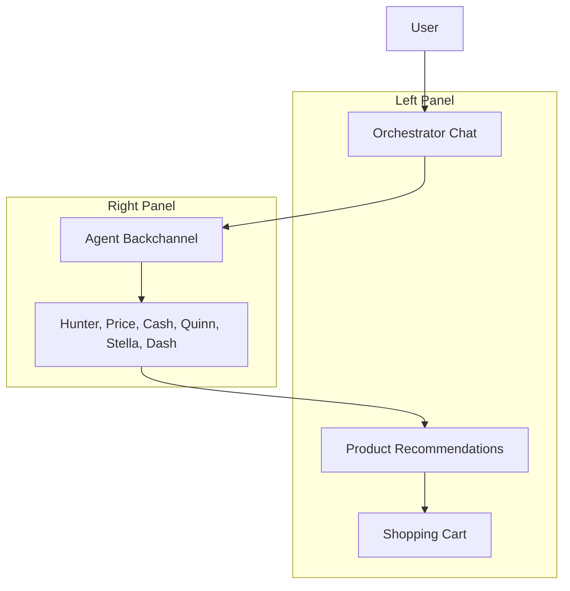

# Design Document

## Overview

CartMate Plus frontend is a React TypeScript application that simulates an AI shopping crew through an interactive chat interface. The application uses a component-based architecture with clear separation between presentation, business logic, and data layers. The design emphasizes modularity, testability, and future backend integration while providing an engaging multi-agent chat experience.

## Architecture

### High-Level Architecture



### Interface Layout

The application uses a dual-pane layout:

- **Left Panel (Main Chat)**: User interacts with a single Orchestrator agent that provides clean, filtered responses with inline product cards
- **Right Panel (Agent Backchannel)**: Shows the "control room" where specialized agents collaborate, debate, and share findings
- **Sidebar (Cart)**: Collapsible shopping cart that can overlay or slide in from the side

### Technology Stack

- **Frontend Framework**: React 18 with TypeScript
- **State Management**: React Context API with useReducer for complex state
- **Styling**: Tailwind CSS for utility-first styling
- **Build Tool**: Vite for fast development and building
- **Testing**: Jest and React Testing Library
- **Type Safety**: Strict TypeScript configuration

### Folder Structure

```
cartmate-frontend/
├── src/
│   ├── components/
│   │   ├── chat/
│   │   ├── agents/
│   │   ├── products/
│   │   ├── cart/
│   │   └── ui/
│   ├── services/
│   ├── types/
│   ├── hooks/
│   ├── context/
│   ├── utils/
│   └── data/
├── public/
└── tests/
```

## Components and Interfaces

### Core Components

#### OrchestratorChat Component
- **Purpose**: Main chat interface where user interacts with the orchestrator agent
- **Props**: None (uses global state)
- **State**: User messages, orchestrator responses, inline products
- **Key Features**: Clean single-agent interface, inline product cards, typing indicators

#### AgentBackchannel Component
- **Purpose**: Right panel showing agent collaboration and discussions
- **Props**: `activeConversation: string`
- **State**: Agent messages, collaboration status, decision making process
- **Key Features**: Multi-agent chat view, agent avatars, real-time updates, transparency into decision process

#### OrchestratorMessage Component
- **Purpose**: Displays orchestrator responses with integrated product recommendations
- **Props**: `message: string`, `products?: Product[]`, `timestamp: Date`
- **Features**: Clean formatting, inline product cards, action buttons

#### AgentMessage Component
- **Purpose**: Displays individual agent messages in the backchannel
- **Props**: `agent: Agent`, `message: string`, `timestamp: Date`, `isResponse?: boolean`
- **Features**: Agent avatar, role badge, message threading, collaboration indicators

#### ProductCard Component
- **Purpose**: Displays product information within chat or standalone
- **Props**: `product: Product`, `onAddToCart: (product: Product) => void`, `compact?: boolean`
- **Features**: Image, price, quick actions, agent recommendations overlay

#### CartSidebar Component
- **Purpose**: Sliding cart panel with Dash agent integration
- **Props**: `isOpen: boolean`, `onClose: () => void`
- **Features**: Cart items, total calculation, Dash optimization suggestions

#### AgentIndicator Component
- **Purpose**: Shows which agents are currently "thinking" or active
- **Props**: `activeAgents: Agent[]`
- **Features**: Animated avatars, role descriptions, collaboration status

### Agent System Design

#### Agent Interface
```typescript
interface Agent {
  id: string;
  name: string;
  role: string;
  avatar: string;
  personality: AgentPersonality;
  specialties: string[];
  responsePatterns: ResponsePattern[];
}

interface AgentPersonality {
  tone: 'friendly' | 'professional' | 'enthusiastic' | 'analytical';
  responseStyle: 'concise' | 'detailed' | 'conversational';
  emoji: boolean;
}
```

#### Agent Definitions
- **Hunter**: Product discovery specialist, enthusiastic tone, uses search and filter language
- **Price**: Deal analyzer, analytical tone, focuses on value and comparisons
- **Cash**: Budget guardian, professional tone, emphasizes financial responsibility
- **Quinn**: Quality assessor, detailed responses, focuses on reviews and specifications
- **Stella**: Style curator, friendly and trendy tone, emphasizes aesthetics and fashion
- **Dash**: Cart optimizer, efficient tone, focuses on logistics and optimization

### Message Flow System

#### Conversation Engine
- **Input Processing**: Analyzes user messages to determine relevant agents
- **Agent Orchestration**: Simulates multi-agent collaboration with realistic delays
- **Response Generation**: Creates contextual responses based on agent personalities
- **Product Integration**: Seamlessly weaves product recommendations into conversations

## Data Models

### Core Data Types

```typescript
interface Product {
  id: string;
  name: string;
  description: string;
  price: number;
  currency: string;
  images: string[];
  category: string;
  tags: string[];
  rating: number;
  reviewCount: number;
  inStock: boolean;
}

interface CartItem {
  product: Product;
  quantity: number;
  addedBy: string; // Agent ID
  addedAt: Date;
}

interface Message {
  id: string;
  type: 'user' | 'agent';
  content: string;
  agentId?: string;
  products?: Product[];
  timestamp: Date;
  metadata?: MessageMetadata;
}

interface Conversation {
  id: string;
  messages: Message[];
  activeAgents: string[];
  context: ConversationContext;
}
```

### Mock Data Structure

The mock data will simulate Google Online Boutique's product catalog structure:
- **Categories**: Clothing, accessories, home goods, electronics
- **Product Attributes**: Match expected backend schema
- **Inventory Simulation**: Stock levels, pricing tiers, seasonal availability
- **Agent Responses**: Pre-defined response templates with dynamic product insertion

## Error Handling

### Error Boundaries
- **ChatErrorBoundary**: Catches chat-related errors without breaking the entire app
- **ProductErrorBoundary**: Handles product loading and display errors
- **AgentErrorBoundary**: Manages agent response failures gracefully

### Error States
- **Network Simulation**: Mock network delays and occasional failures
- **Product Unavailable**: Graceful handling when products go out of stock
- **Agent Timeout**: Fallback responses when agents don't respond in time
- **Invalid Input**: User input validation and helpful error messages

### Retry Mechanisms
- **Exponential Backoff**: For simulated API calls
- **Agent Fallback**: Alternative agents when primary agents fail
- **Graceful Degradation**: Core functionality remains available during errors

## Testing Strategy

### Unit Testing
- **Component Testing**: Each component tested in isolation with React Testing Library
- **Service Testing**: Mock data services and agent logic tested independently
- **Hook Testing**: Custom hooks tested with @testing-library/react-hooks
- **Utility Testing**: Pure functions and helpers tested with Jest

### Integration Testing
- **Chat Flow Testing**: End-to-end conversation scenarios
- **Agent Interaction Testing**: Multi-agent collaboration scenarios
- **Cart Integration Testing**: Product addition and cart management flows
- **State Management Testing**: Context and reducer behavior testing

### E2E Testing (Future)
- **User Journey Testing**: Complete shopping scenarios
- **Cross-Browser Testing**: Compatibility across modern browsers
- **Mobile Responsiveness**: Touch interactions and mobile-specific features
- **Performance Testing**: Load times and interaction responsiveness

### Test Data Management
- **Mock Factories**: Consistent test data generation
- **Scenario Templates**: Pre-defined conversation and shopping scenarios
- **Agent Response Mocking**: Predictable agent behavior for testing
- **State Snapshots**: Reproducible application states for testing

## Performance Considerations

### Optimization Strategies
- **Component Memoization**: React.memo for expensive components
- **Virtual Scrolling**: For long conversation histories
- **Image Lazy Loading**: Product images loaded on demand
- **Code Splitting**: Route-based and component-based splitting

### State Management Optimization
- **Context Splitting**: Separate contexts for different concerns
- **Selective Re-rendering**: Minimize unnecessary component updates
- **Debounced Inputs**: User input handling optimization
- **Cached Responses**: Agent response caching for repeated queries

### Bundle Size Management
- **Tree Shaking**: Remove unused code
- **Dynamic Imports**: Load features on demand
- **Asset Optimization**: Compressed images and optimized fonts
- **Dependency Analysis**: Regular audit of package sizes