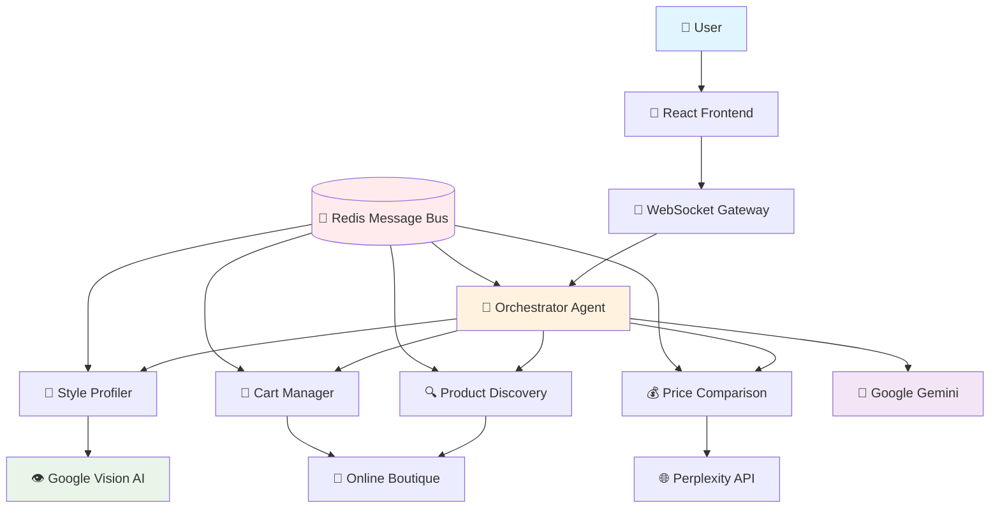
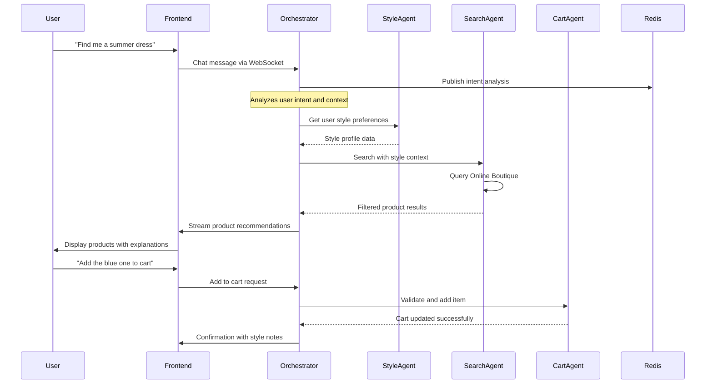

# CartMate
*The Future of AI-Powered Shopping Experience*

[](https://github.com/cartmate/cartmate)
[](https://github.com/cartmate/cartmate/releases)
[](LICENSE)
[](https://cloud.google.com/vertex-ai)

> **CartMate** transforms traditional e-commerce into an intelligent, conversational shopping experience. Shop naturally through AI conversations, discover products through style analysis, and enjoy seamless purchase journeys—all powered by Google's Vertex AI.

---

## ✨ **What Makes CartMate Different**

CartMate isn't just another shopping platform—it's a **complete reimagining** of how people discover, evaluate, and purchase products online. Instead of navigating complex interfaces and filters, users simply **chat** with our AI to find exactly what they need.

### **Core Experience Features**

🎯 **Conversational Commerce**  
Shop through natural conversation—describe what you want, ask questions, get recommendations

🎨 **Visual Style Intelligence**  
Upload images to teach our AI your style preferences and receive perfectly matched recommendations

🔍 **Context-Aware Discovery**  
Our AI remembers your conversation history and preferences to suggest increasingly relevant products

💰 **Smart Price Intelligence**  
Automatic price comparison and deal discovery across multiple retailers in real-time

🛒 **Intelligent Cart Management**  
Style-coherent cart validation and outfit coordination suggestions

⚡ **Real-Time Experience**  
Instant responses through WebSocket-powered chat interface

---

## 🏗️ **System Architecture**

CartMate is built on a sophisticated **multi-agent architecture** where specialized AI agents collaborate to deliver a seamless shopping experience.



### **Agent Responsibilities**

| Agent | Purpose | AI Service |
|-------|---------|------------|
| **🤖 Orchestrator** | Primary conversation management and workflow coordination | Google Gemini |
| **🎨 Style Profiler** | Visual analysis and preference learning from user images | Google Vision AI |
| **🔍 Product Discovery** | Intelligent product search with style-aware filtering | Custom + Online Boutique |
| **💰 Price Comparison** | Real-time market analysis and competitive pricing | Perplexity API |
| **🛒 Cart Manager** | Transaction handling with style coherence validation | Online Boutique gRPC |

---

## 🚀 **Technology Stack**

### **Frontend Excellence**
```typescript
// Modern React with TypeScript
const CartMateApp: React.FC = () => {
  const [conversation, setConversation] = useState<Message[]>([]);
  const socket = useWebSocket('/ws/chat');
  
  return <ConversationalShoppingInterface />;
};
```

- **React 18** with TypeScript for type-safe development
- **Tailwind CSS** for responsive, modern UI design
- **WebSocket Client** for real-time bidirectional communication
- **Vite** for lightning-fast development experience

### **Backend Power**
```python
# FastAPI with async WebSocket support
@app.websocket("/ws/chat")
async def websocket_endpoint(websocket: WebSocket, session_id: str):
    await orchestrator.handle_conversation(websocket, session_id)
```

- **Python 3.11+** with FastAPI for high-performance async APIs
- **Redis** for session management and inter-agent messaging
- **WebSockets** for real-time communication
- **Pydantic** for robust data validation

### **AI Integration**
- **Google Vertex AI (Gemini)** for conversational intelligence
- **Google Vision AI** for sophisticated image analysis
- **Perplexity API** for real-time market research
- **Custom A2A Protocol** for seamless agent coordination

### **Production Infrastructure**
- **Kubernetes** deployment on Google Cloud Platform
- **Docker** containerization for consistent environments
- **Redis Cluster** for scalable message passing
- **LoadBalancer** for high availability

---

## 📊 **System Flow**



---

## 🛠️ **Quick Start Guide**

### **Prerequisites**
- **Python 3.11+** and **Node.js 18+**
- **Redis Server** (local or cloud)
- **Google Cloud Platform** account with Vertex AI enabled
- **Docker** (optional, for containerized deployment)

### **Local Development Setup**

#### **1. Clone the Repository**
```bash
git clone https://github.com/your-org/cartmate.git
cd cartmate
```

#### **2. Backend Configuration**
```bash
cd cartmate-backend

# Create virtual environment
python -m venv venv
source venv/bin/activate  # Linux/Mac
# or
venv\Scripts\activate     # Windows

# Install dependencies
pip install -r requirements.txt

# Configure environment
cp .env.example .env
# Edit .env with your credentials
```

#### **3. Frontend Setup**
```bash
cd cartmate-frontend
npm install
```

#### **4. Start Services**
```bash
# Terminal 1: Start Redis
redis-server

# Terminal 2: Start Backend
cd cartmate-backend
source venv/bin/activate
python main.py

# Terminal 3: Start Frontend
cd cartmate-frontend
npm run dev
```

#### **5. Access CartMate**
Open [http://localhost:5173](http://localhost:5173) and start shopping! 🛍️

---

## ⚙️ **Configuration**

### **Environment Variables**
```env
# Google Cloud AI Services
GOOGLE_APPLICATION_CREDENTIALS=/path/to/service-account.json
GOOGLE_CLOUD_PROJECT=your-project-id
VERTEX_AI_LOCATION=us-central1

# Redis Configuration
REDIS_URL=redis://localhost:6379
REDIS_PASSWORD=your-redis-password

# External Service APIs
PERPLEXITY_API_KEY=your-perplexity-api-key
ONLINE_BOUTIQUE_ENDPOINT=your-boutique-grpc-endpoint

# Application Settings
DEBUG=true
LOG_LEVEL=INFO
CORS_ORIGINS=http://localhost:5173
```

### **Google Cloud Setup**
```bash
# Authenticate with Google Cloud
gcloud auth application-default login

# Enable required APIs
gcloud services enable aiplatform.googleapis.com
gcloud services enable vision.googleapis.com
```

---

## 📁 **Project Structure**

```
CartMate/
├── 🐍 cartmate-backend/              # Python FastAPI backend
│   ├── agents/                       # Specialized AI agents
│   │   ├── 🤖 orchestrator.py       # Main conversation coordinator  
│   │   ├── 🎨 style_profiler.py     # Visual style analysis
│   │   ├── 🔍 product_discovery.py  # Intelligent product search
│   │   ├── 💰 price_comparison.py   # Market pricing analysis
│   │   └── 🛒 cart_management.py    # Smart cart operations
│   ├── a2a/                          # Agent-to-Agent protocol
│   │   ├── coordinator.py            # Multi-agent coordination
│   │   └── message_bus.py            # Redis-based messaging
│   ├── api/                          # WebSocket & HTTP endpoints
│   ├── services/                     # External service clients
│   │   ├── vertex_ai.py              # Google AI integration
│   │   ├── online_boutique.py        # Product catalog service
│   │   └── perplexity.py             # Market research API
│   └── models/                       # Data models & validation
├── ⚛️ cartmate-frontend/             # React TypeScript frontend
│   ├── src/
│   │   ├── components/               # React components
│   │   │   ├── chat/                 # Conversation interface
│   │   │   ├── products/             # Product display components
│   │   │   ├── cart/                 # Shopping cart management
│   │   │   └── ui/                   # Reusable UI elements
│   │   ├── services/                 # API service clients
│   │   ├── hooks/                    # Custom React hooks
│   │   └── utils/                    # Utility functions
├── 🚢 k8s/                          # Kubernetes deployment
│   ├── backend-deployment.yaml
│   ├── frontend-deployment.yaml
│   ├── redis-deployment.yaml
│   └── ingress.yaml
└── 📜 scripts/                      # Deployment & utility scripts
    ├── deploy-local.sh
    ├── deploy-gcp.sh
    └── setup-env.sh
```

---

## 🧪 **Testing Strategy**

### **Backend Testing**
```bash
cd cartmate-backend
source venv/bin/activate

# Run all tests with coverage
pytest --cov=. tests/

# Test specific components
pytest tests/agents/test_orchestrator.py -v
pytest tests/api/test_websocket.py -v
pytest tests/a2a/test_coordination.py -v
```

### **Frontend Testing**
```bash
cd cartmate-frontend

# Unit tests
npm test

# E2E tests
npm run test:e2e

# Component testing
npm run test:components
```

### **Integration Testing**
```bash
# Full system integration tests
docker-compose -f docker-compose.test.yml up --build
```

---

## 🚀 **Deployment Options**

### **Production Deployment on GCP**

```bash
# Deploy to Google Kubernetes Engine
./scripts/deploy-gcp.sh

# Or using Kubernetes directly
kubectl apply -f k8s/
```

### **Docker Compose (Development)**
```bash
# Single command deployment
docker-compose up --build

# Background deployment
docker-compose up -d --build
```

### **Local Development**
```bash
# Use the provided script
./scripts/deploy-local.sh
```

---

## 📊 **Monitoring & Observability**

### **Health Endpoints**
| Endpoint | Purpose |
|----------|---------|
| `/health` | Overall system health |
| `/agents/status` | Individual agent status |
| `/metrics` | Prometheus metrics |
| `/docs` | Interactive API documentation |

### **Real-time Monitoring**
```python
# Built-in structured logging
logger.info("Agent coordination started", 
           extra={"correlation_id": session_id, 
                  "agent": "orchestrator"})
```

---

## 🎯 **Usage Examples**

### **Natural Shopping Conversations**
```
User: "I'm looking for something casual but stylish for a weekend brunch"

CartMate: I'd love to help you find the perfect brunch outfit! To give you the 
best recommendations, could you tell me:
- What's your preferred style? (bohemian, minimalist, classic, trendy?)
- Any specific colors you're drawn to?
- What's your comfort level with showing skin?

Feel free to also share a photo of an outfit you love - I can learn your 
style preferences that way! 📸
```

### **Style-Based Discovery**
```
User: [uploads image of favorite outfit]

CartMate: I love your style! I can see you prefer:
✨ Earthy, warm tones (especially that beautiful rust color)
✨ Relaxed but tailored fits
✨ Natural textures and fabrics

Based on this, I found some perfect brunch pieces that match your aesthetic...
```

---

## 🤝 **Contributing**

We welcome contributions that help make shopping more intelligent and delightful!

### **Development Workflow**
1. **Fork** the repository
2. **Create** a feature branch (`git checkout -b feature/amazing-shopping-feature`)
3. **Develop** with comprehensive tests
4. **Commit** with clear, descriptive messages
5. **Push** to your branch (`git push origin feature/amazing-shopping-feature`)
6. **Create** a Pull Request

### **Code Standards**
- **Python**: Follow PEP 8, use type hints, write docstrings
- **TypeScript**: Strict mode enabled, comprehensive interfaces
- **Testing**: Maintain >90% coverage for critical paths
- **Documentation**: Update README for new features

---

## 🔒 **Security & Privacy**

- **🔐 Secure Authentication**: Google Cloud IAM integration
- **🛡️ Input Validation**: Comprehensive sanitization and validation
- **🚦 Rate Limiting**: Prevents abuse and ensures fair usage
- **🔒 Data Privacy**: User conversations and preferences are encrypted
- **🌐 CORS Protection**: Properly configured cross-origin policies

---

## 📈 **Performance Optimizations**

- **⚡ WebSocket Connections**: Real-time, low-latency communication
- **📦 Redis Caching**: Fast session and preference storage
- **🔄 Async Processing**: Non-blocking operations throughout
- **🎯 Smart Caching**: Intelligent product and style preference caching
- **📱 Responsive Design**: Optimized for all device sizes

---

## 🐛 **Troubleshooting**

<details>
<summary><strong>Common Issues & Solutions</strong></summary>

### **Redis Connection Issues**
```bash
# Test Redis connectivity
redis-cli ping
# Should return: PONG

# Check Redis logs
tail -f /var/log/redis/redis-server.log
```

### **Google Cloud Authentication**
```bash
# Check current authentication
gcloud auth list

# Re-authenticate if needed
gcloud auth application-default login
```

### **Port Conflicts**
```bash
# Check port usage (Windows)
netstat -an | findstr :8000

# Check port usage (Linux/Mac)
lsof -i :8000
```

### **WebSocket Connection Failures**
- Verify backend is running on correct port
- Check CORS configuration in FastAPI
- Ensure Redis is accessible from backend

</details>


## 🎖️ **Acknowledgments**

- **Google Cloud Vertex AI** for powerful conversational and vision AI
- **FastAPI** for the excellent async Python web framework  
- **React & TypeScript** for modern, type-safe frontend development
- **Redis** for reliable real-time messaging and caching
- **Online Boutique** for providing the e-commerce microservices foundation

---

<div align="center">

**CartMate** - *Where Shopping Meets Intelligence* 🛍️🤖


</div>